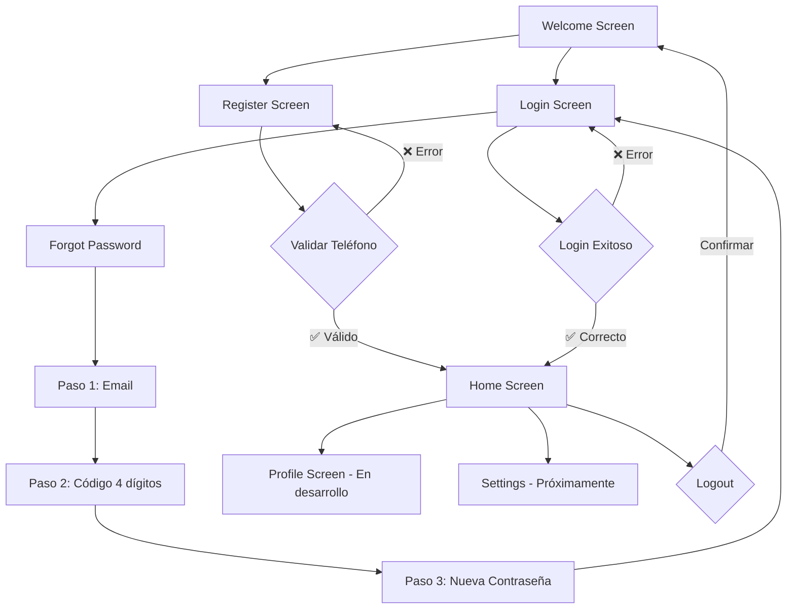

# 🐦 Bluebird App - Versión 2.0

<div align="center">
  
  
  **Una aplicación Flutter moderna con sistema de autenticación completo y diseño responsive**
  
  [](https://flutter.dev)
  [](https://dart.dev)
  [](https://opensource.org/licenses/MIT)
  
</div>

---

## 🆕 **Novedades en la Versión 2.0**

### ✨ **Nuevas Funcionalidades Implementadas:**

#### 📱 **Campo de Teléfono en Registro**
- ✅ Campo obligatorio de número de teléfono
- ✅ Validación inteligente (10-15 dígitos, formatos internacionales)
- ✅ Teclado numérico automático
- ✅ Soporte para formatos: `+52 999 123 4567`, `(999) 123-4567`, `999-123-4567`

#### 🏠 **Pantalla de Inicio (HomeScreen)**
- ✅ Bienvenida personalizada con el pájaro de Bluebird
- ✅ Muestra email y teléfono del usuario registrado
- ✅ 3 botones de acción: **Perfil**, **Configuración**, **Cerrar Sesión**
- ✅ Navegación limpia con `pushAndRemoveUntil`
- ✅ Confirmación elegante para cerrar sesión

#### 🔒 **Recuperación de Contraseña Rediseñada**
- ✅ **Flujo en 3 pasos** con indicador visual de progreso
- ✅ **Paso 1**: Ingreso de email
- ✅ **Paso 2**: Código de verificación de 4 dígitos
  - Timer de 5 minutos con formato `mm:ss`
  - Código de ejemplo: **1234** (visible para testing)
  - Auto-verificación al completar los 4 dígitos
  - Opción de reenvío de código
- ✅ **Paso 3**: Creación de nueva contraseña
- ✅ Navegación automática entre pasos

#### 🔐 **Validaciones Expandidas**
- ✅ `validatePhone()` - Números de teléfono con múltiples formatos
- ✅ `validateName()` - Nombres con acentos y caracteres especiales
- ✅ `validateStrongPassword()` - Contraseñas seguras (8+ chars, mayús, minús, números)
- ✅ `validateEmailStrict()` - Validación de email más robusta
- ✅ `validateRequired()` - Validador genérico reutilizable

---

## 📱 **Pantallas Actualizadas**

| Pantalla | Estado | Nuevas Características |
|----------|---------|------------------------|
| **Welcome Screen** | ✅ Sin cambios | Pantalla de bienvenida original |
| **Login Screen** | ✅ Actualizado | • Navegación a HomeScreen<br>• Login con Google simulado<br>• Mensajes de éxito mejorados |
| **Register Screen** | ✅ Actualizado | • **Campo de teléfono obligatorio**<br>• Navegación a HomeScreen<br>• Validaciones completas |
| **Forgot Password** | 🆕 **Rediseñado** | • **Flujo de 3 pasos**<br>• Código de verificación<br>• Timer y reenvío<br>• Indicador de progreso |
| **Verification Screen** | ✅ Sin cambios | Código de 6 dígitos original |
| **Home Screen** | 🆕 **Nueva** | • Pantalla principal post-login<br>• Bienvenida personalizada<br>• Botones de acción |
| **Profile Screen** | ⏳ Pendiente | • En desarrollo<br>• Edición de perfil completa |

---

## 🎯 **Flujo de Usuario Actualizado**



---

## 🔧 **Instalación y Configuración**

### Prerrequisitos

- **Flutter SDK** (>=3.0.0)
- **Dart SDK** (>=2.17.0)
- **Android Studio** o **VS Code**

### Pasos de Instalación

```bash
# 1. Clonar el repositorio
git clone https://github.com/EsveBavi/bluebird-app.git

# 2. Navegar al directorio
cd bluebird-app

# 3. Instalar dependencias
flutter pub get

# 4. Verificar configuración
flutter doctor

# 5. Ejecutar la aplicación
flutter run
```

---

## 📁 **Estructura Actualizada del Proyecto**

```
lib/
├── constants/              
│   └── app_constants.dart       # ✅ Agregado phoneHint
├── screens/                
│   ├── welcome_screen.dart      # Sin cambios
│   ├── login_screen.dart        # ✅ Navegación a Home
│   ├── register_screen.dart     # 🆕 Campo de teléfono
│   ├── forgot_password_screen.dart # 🆕 Rediseñado completo
│   ├── verification_screen.dart # Sin cambios
│   └── home_screen.dart         # 🆕 Nueva pantalla
├── widgets/                
│   ├── custom_button.dart       # Sin cambios
│   ├── custom_text_field.dart   # Sin cambios
│   └── bird_widget.dart         # Sin cambios
├── utils/                  
│   └── validators.dart          # 🆕 5 validadores nuevos
└── main.dart               # Sin cambios

assets/
└── images/
    └── birdblue.png       # Imagen del pájaro mascota
```

---

## 🎮 **Guía de Testing**

### 📝 **Datos para Pruebas**

#### **Registro:**
```
Email: test@bluebird.com
Teléfono: +52 999 123 4567  (o cualquier formato válido)
Contraseña: 123456
```

#### **Login:**
```
Email: cualquier@email.com
Contraseña: cualquier contraseña (6+ chars)
```

#### **Recuperar Contraseña:**
```
Paso 1: cualquier@email.com
Paso 2: 1234 (código mostrado en pantalla)
Paso 3: nueva123 (nueva contraseña)
```

### 🧪 **Escenarios de Prueba**

| Escenario | Pasos | Resultado Esperado |
|-----------|-------|-------------------|
| **Registro Exitoso** | 1. Email válido<br>2. Teléfono válido<br>3. Contraseñas coincidentes | Navegación a HomeScreen |
| **Teléfono Inválido** | 1. Teléfono con menos de 10 dígitos | Error de validación |
| **Recuperar Contraseña** | 1. Email → 2. Código 1234 → 3. Nueva contraseña | Regreso a Login |
| **Código Incorrecto** | 1. Email → 2. Código diferente a 1234 | Error + limpiar campos |
| **Timer Expirado** | 1. Esperar 5 minutos en código | Botón "Reenviar" activo |

---

## ⚙️ **Configuraciones y Personalizaciones**

### 🎨 **Colores (app_constants.dart)**
```dart
static const Color primaryBlue = Color(0xFF4461F2);      
static const Color lightBlue = Color(0xFF60A5FA);        
static const Color backgroundColor = Color(0xFF0F172A);   
static const Color cardColor = Color(0xFF1E293B);        
```

### 📝 **Textos**
```dart
static const String appName = "Bluebird Soft";
static const String phoneHint = "Número de teléfono";    // 🆕 Nuevo
```

### 📱 **Validaciones de Teléfono**
```dart
// Formatos aceptados:
✅ +52 999 123 4567
✅ (999) 123-4567
✅ 999-123-4567
✅ 9991234567
❌ 12345 (muy corto)
❌ abc123 (caracteres inválidos)
```

---

## 📚 **Dependencias**

### **Dependencias Principales**
```yaml
dependencies:
  flutter:
    sdk: flutter
  cupertino_icons: ^1.0.2
  google_fonts: ^6.1.0      # Para tipografía Poppins

dev_dependencies:
  flutter_test:
    sdk: flutter
  flutter_lints: ^2.0.0
```

---

## 🚀 **Funcionalidades Implementadas**

### ✅ **Sistema de Autenticación Completo**
- Registro con email y teléfono
- Login con validación
- Recuperación de contraseña en 3 pasos
- Navegación segura entre pantallas

### ✅ **Validaciones Robustas**
- Email con regex mejorado
- Teléfono con formatos internacionales
- Contraseñas con confirmación
- Códigos de verificación

### ✅ **Experiencia de Usuario**
- Estados de carga con spinners
- Mensajes de éxito/error
- Navegación intuitiva
- Diseño responsive

### ✅ **Interfaz Moderna**
- Tema oscuro consistente
- Animaciones suaves
- Iconos expresivos
- Pájaro de Bluebird como mascota

---

## 🎯 **Próximas Funcionalidades (Roadmap)**

### 🚧 **En Desarrollo**
- [ ] **Pantalla de Perfil** - Edición completa de datos personales
- [ ] **Configuraciones** - Tema, notificaciones, privacidad
- [ ] **Persistencia de datos** - SQLite o SharedPreferences

### 📅 **Planificado para v3.0**
- [ ] Integración con Firebase Auth
- [ ] Push notifications
- [ ] Modo claro/oscuro
- [ ] Internacionalización (i18n)
- [ ] Biometría (huella/Face ID)
- [ ] Onboarding tutorial

### 🔮 **Futuro**
- [ ] Chat interno
- [ ] Sincronización en la nube
- [ ] Análitica de usuarios
- [ ] Tests automatizados

---

## 🐛 **Problemas Conocidos y Soluciones**

### ⚠️ **Issues Comunes**

| Problema | Causa | Solución |
|----------|-------|----------|
| Error de navegación a HomeScreen | Falta importación | `import 'home_screen.dart';` |
| Validación de teléfono falla | Formato no reconocido | Usar: `+52 999 123 4567` |
| Timer no funciona | Estado no actualizado | Usar `setState()` en timer |
| Código no se auto-verifica | Focus no cambia | Verificar `_codeFocusNodes` |

### 🔧 **Debugging Tips**

```bash
# Ver logs detallados
flutter run --verbose

# Limpiar cache si hay problemas
flutter clean && flutter pub get

# Verificar dispositivos conectados
flutter devices

# Hot reload durante desarrollo
r (en la terminal mientras corre la app)
```

---

## 📊 **Métricas y Estadísticas**

### 📈 **Progreso del Proyecto**

- **Pantallas Completadas:** 6/7 (85.7%)
- **Validaciones:** 8 tipos diferentes
- **Líneas de Código:** ~2,500+
- **Archivos:** 12 archivos principales
- **Funcionalidades:** 15+ características

### 🎨 **Componentes Personalizados**

- **CustomButton** - Botones con estados de carga
- **CustomTextField** - Campos con validación integrada  
- **BirdWidget** - Widget del pájaro mascota
- **Validators** - Sistema completo de validaciones

---

## 🤝 **Contribuciones**

### 📝 **Cómo Contribuir**

1. **Fork** el proyecto
2. Crea una **rama** (`git checkout -b feature/nueva-funcionalidad`)
3. **Commit** tus cambios (`git commit -m '✨ Nueva funcionalidad'`)
4. **Push** a la rama (`git push origin feature/nueva-funcionalidad`)
5. Abre un **Pull Request**

### 📋 **Convenciones de Commits**

- `✨ feat:` nueva funcionalidad
- `🐛 fix:` corrección de errores
- `📝 docs:` documentación
- `💄 style:` cambios de estilo
- `♻️ refactor:` refactorización
- `⚡ perf:` mejoras de rendimiento
- `✅ test:` tests

---

## 📄 **Licencia**

Este proyecto está bajo la **Licencia MIT**. 

```
MIT License

Copyright (c) 2024 EsveBavi

Permission is hereby granted, free of charge, to any person obtaining a copy
of this software and associated documentation files (the "Software"), to deal
in the Software without restriction, including without limitation the rights
to use, copy, modify, merge, publish, distribute, sublicense, and/or sell
copies of the Software, subject to the following conditions:

The above copyright notice and this permission notice shall be included in all
copies or substantial portions of the Software.

THE SOFTWARE IS PROVIDED "AS IS", WITHOUT WARRANTY OF ANY KIND, EXPRESS OR
IMPLIED, INCLUDING BUT NOT LIMITED TO THE WARRANTIES OF MERCHANTABILITY,
FITNESS FOR A PARTICULAR PURPOSE AND NONINFRINGEMENT.
```

---

## 👤 **Autor**

**EsveBavi**
- GitHub: [@EsveBavi](https://github.com/EsveBavi)
- Proyecto: [bluebird-app](https://github.com/EsveBavi/bluebird-app)

---

## 🎉 **Changelog - Versión 2.0**

### 🆕 **Agregado**
- Campo de teléfono en registro con validación completa
- Pantalla HomeScreen con bienvenida personalizada
- Sistema de recuperación de contraseña en 3 pasos
- 5 nuevos tipos de validaciones
- Timer y reenvío de código de verificación
- Navegación mejorada con limpieza de stack
- Mensajes de éxito/error más informativos

### 🔄 **Cambiado**
- Flujo de registro ahora incluye teléfono
- ForgotPasswordScreen completamente rediseñada
- Validaciones más robustas y específicas
- Navegación post-login/registro va a HomeScreen

### 🐛 **Corregido**
- Problemas de navegación entre pantallas
- Validación de formatos de teléfono
- Estados de carga más consistentes
- Limpieza adecuada de controladores

---

<div align="center">
  <p>Hecho con ❤️ usando Flutter</p>
  
  **¡Si este proyecto te ayudó, dale una ⭐️!**
  
  
  
</div>
